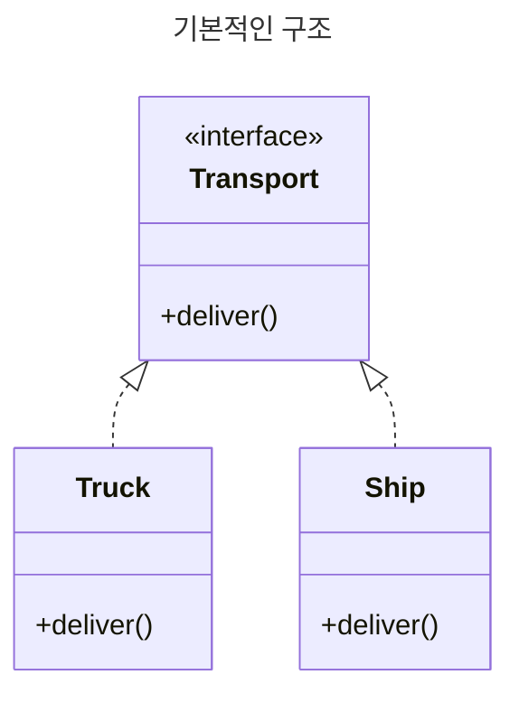
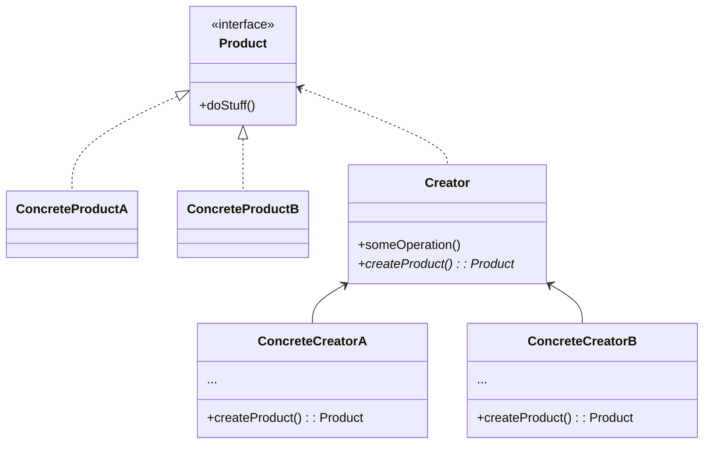

> https://refactoring.guru/ko/design-patterns/factory-method

> 부모 클래스에서 객체들을 생성할 수 있는 인터페이스를 제공하지만,
> 자식 클래스들이 생성될 객체들의 유형을 변경할 수 있도록 하는 생성 패턴

### Example
> `Truck` Class 만 존재해 이걸로 모든 물류를 처리
> 해상 물류 기능 처리가 필요

### Example
이 예시에서는 팩토리 구조체​(struct)​를 사용하여 다양한 유형의 무기를 만들 것입니다.

먼저 총에 있어야 하는 모든 메서드들을 정의하는 i­Gun 인터페이스를 만듭니다. iGun 인터페이스를 구현하는 gun 구조체​(struct) 유형이 있습니다. 두 개의 구상 총들​(ak47 및 musket)​은 총 구조체​(struct)​를 포함하고 모든 i­Gun 메서드들을 간접적으로 구현합니다.

gun­Factory 구조체​(struct)​는 팩토리의 역할을 하며, 수신된 인수를 기반으로 요청된 유형의 총들을 생성합니다. main.go는 클라이언트의 역할을 하며 ak47 또는 musket과 직접 상호작용하는 대신 gun­Factory에 의존하여 다양한 총들의 인스턴스를 생성하고, 생성을 문자열 매개변수만 사용하여 제어합니다.