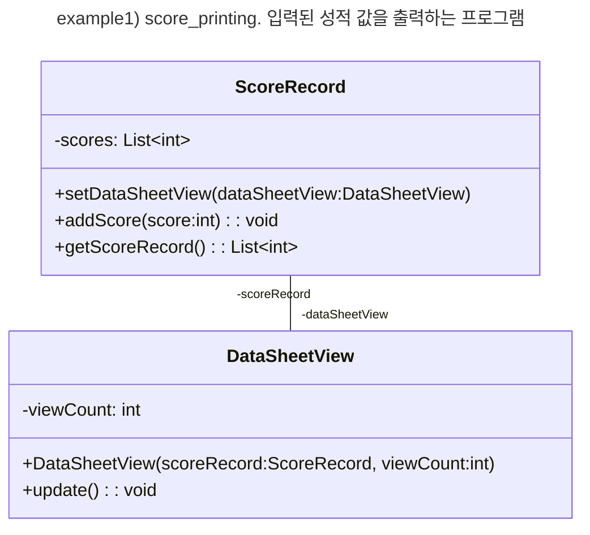

> https://gmlwjd9405.github.io/2018/07/08/observer-pattern.html

* 한 객체의 상태 변화에 따라 다른 객체의 상태도 연동되도록 **일대다 객체 의존 관계를 구성** 하는 패턴
  * 데이터의 변경이 발생했을 경우, **상태 클래스나 객체에 의존하지 않으면서 데이터 변경을 통보하고자 할 떄**, 유용하다.

* 통보 대상 객체 관리를 *Subject 클래스* 와 *Observer 인터페이스* 로 일반화한다.
  * *Observer*
    * 데이터의 변경을 통보받는 인터페이스
  * *Subject*
    * ConcreteObserver 객체를 관리하는 요소
  * *ConcreteSubject*
    * 변경 관리 대상이 되는 데이터가 있는 클래스 (통보하는 클래스)
  * *ConcreteObserver*
    * *ConcreteSubject* 의 변경을 통보받는 클래스

